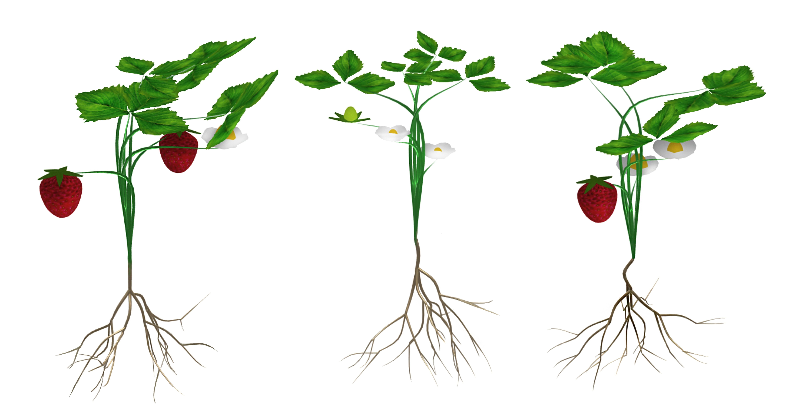
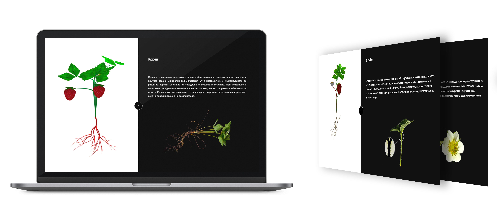

<h1>Dynamic Generation of a 3D strawberry model</h1>

The app is developed with Three.js.

The app generates dynamically a 3D strawberry model. The user can see more information of the plant by selecting different parts of it.

Run the project: (http-server should be preinstalled)

<code>npm install</code>
 
<code>http-server</code>

